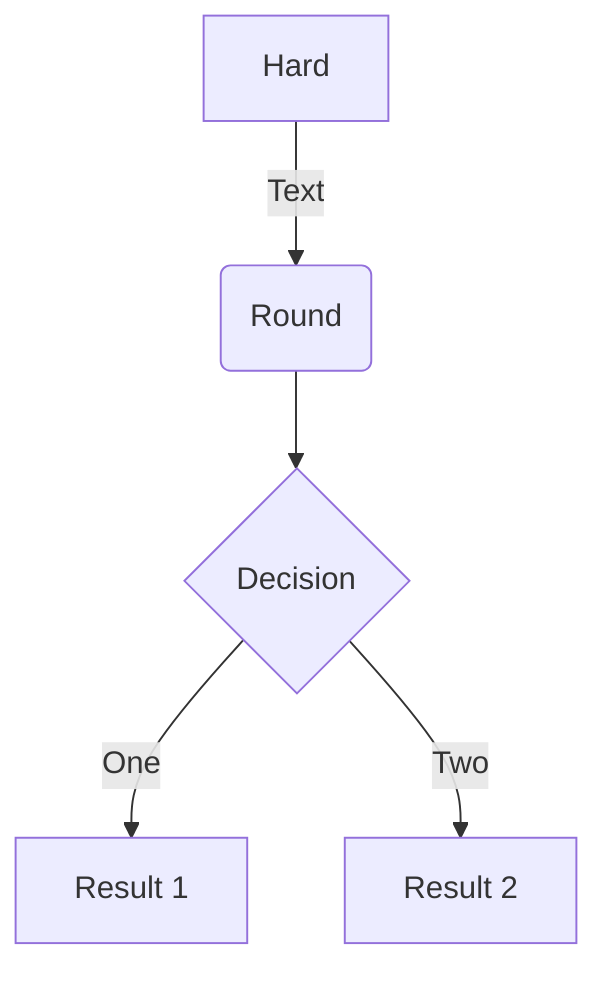
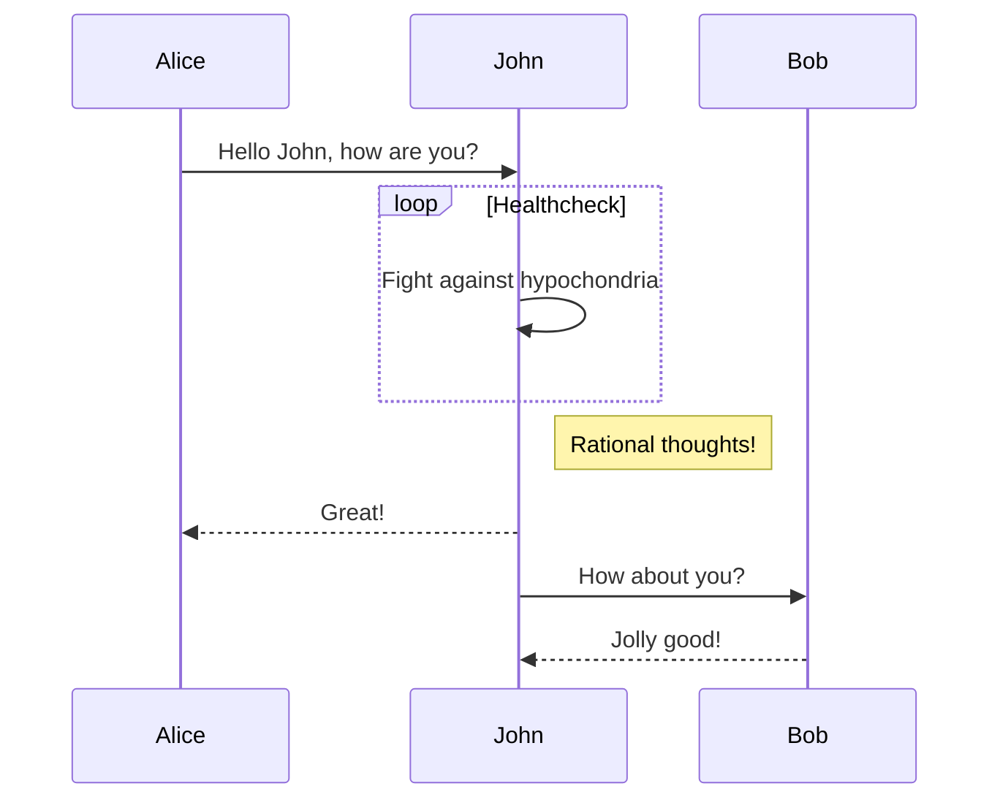
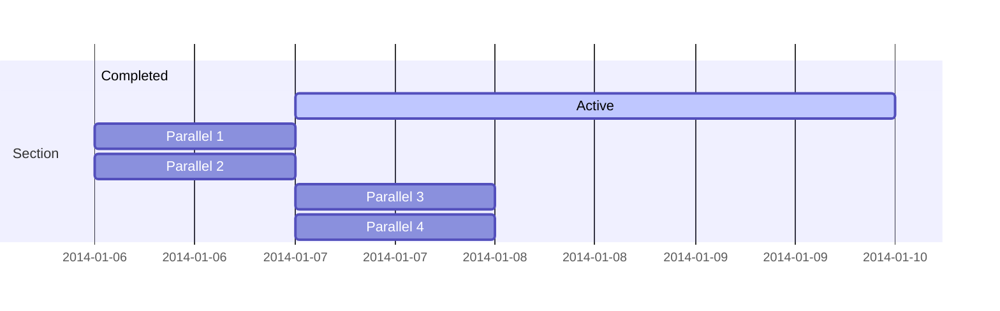
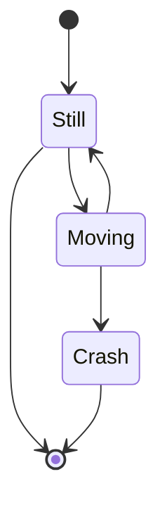
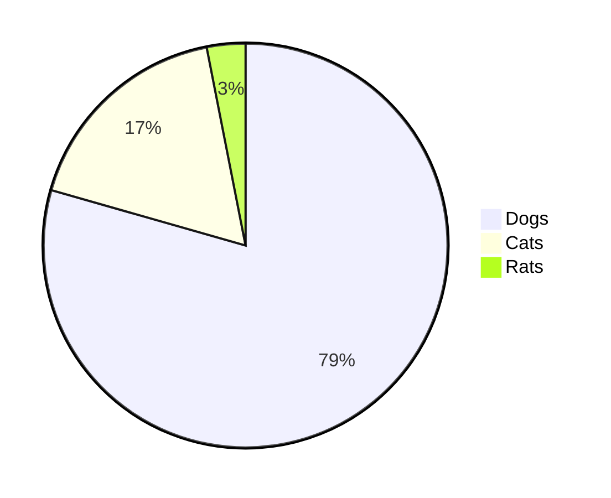
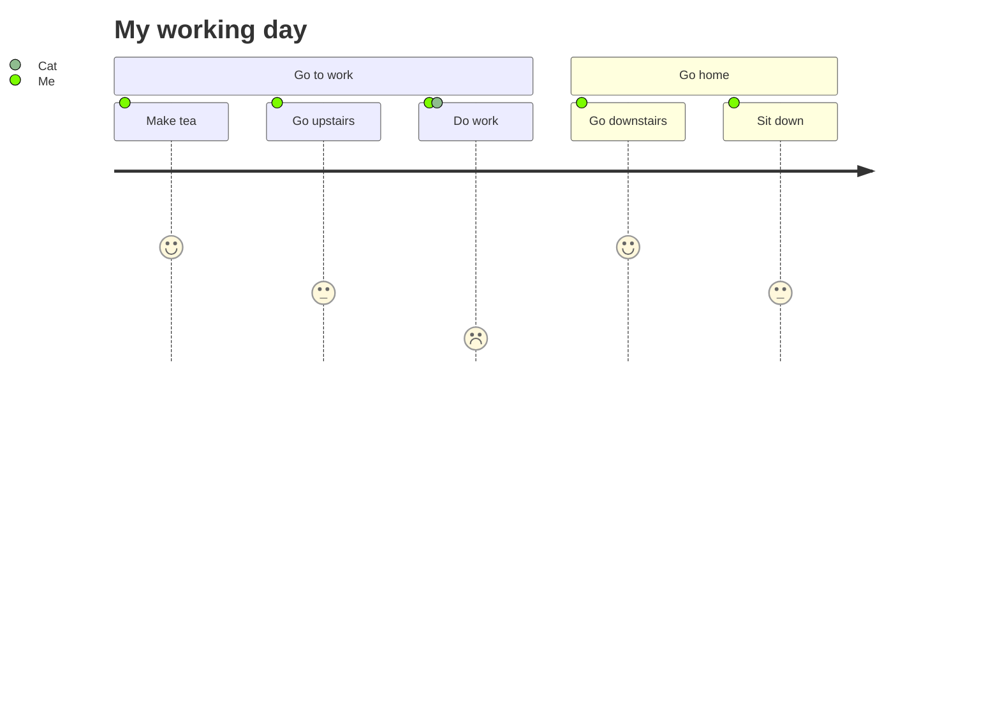

_参考教程_：https://www.runoob.com/markdown/md-tutorial.html

> # 准备工作
因为手边正好有VS Code，不想再安装额外的软件了，所以就决定用VS Code来进行练习了。
- VS Code 安装教程：https://www.runoob.com/w3cnote/vscode-tutorial.html
- VS Code 官网地址：https://code.visualstudio.com/
- Markdown Preview Enhanced ：Markdown 的右侧预览窗口优化
- Markdown Shortcuts ：可以实现一键套用Markdown 格式，不用每次手敲符号了

# Markdown 标题语法
**使用 `=` 和 `-` 标记一级和二级标题**
示例：
```
我是一级标题
===========
我是二级标题
-----------
```
显示效果：
> 我是一级标题
> ===========
> 我是二级标题
> -----------

**使用 # 标记**
使用 `#` 可以表示 1~6 级标题，一级对应一个 `#` 号，二级对应两个 `#` 号，以此类推
示例：
```
# 一级标题
## 二级标题
### 三级标题
#### 四级标题
##### 五级标题
###### 六级标题
```
显示效果：
> # 一级标题
> ## 二级标题
> ### 三级标题
> #### 四级标题
> ##### 五级标题
> ###### 六级标题

---

# Markdown 段落语法

Markdown 段落没有特殊的格式，实测段落的换行直接用回车就好：

---

# Markdown 字体语法
Markdown字体可使用以下格式切换：
```
*斜体文字*
_斜体文字_
**粗体文字**
__粗体文字__
***粗斜体文字***
___粗斜体文字___
```
显示效果：
> *斜体文字*
> _斜体文字_
> **粗体文字**
> __粗体文字__
> ***粗斜体文字***
> ___粗斜体文字___

---

# 分割线
你可以在一行内使用三个以上的 星号`*`、减号`-`、下划线`_`来建立一条分割线，行内不能有其他东西，但可以在符号中间插入空格。
以下方式都可以成功创建分割线：
```
---
___
***
- - -
_ _ _
* * *
```
不出意外的话下面的区块中应该有6条分割线：
> ---
> ___
> ***
> - - -
> _ _ _
> * * *

---

# 删除线
删除线可以在文字两端加上两个波浪线`~`：
```
我还好
~~我没了~~
```
显示效果：
> 我还好
> ~~我没了~~

---

# 下划线
下划线可通过HTML的`<u>`标签来实现：
```
<u>划重点！</u>
```
显示效果：
> <u>划重点！</u>

---

# 脚注
脚注可用作对文本的补充说明。
示例：
```
张三李四 [^1]
[^1]： 这是俩人名
```
显示效果：
脚注会附在最后，点击跳转查看效果

> 张三李四 [^1]
 [^1]: 这是两个人名


---

# Markdown 列表语法
Markdown支持有序和无序列表。

**无序列表**：使用星号`*`、加号`+`或减号`-`进行列表项标记，每个列表项需要在符号后面加上一个空格才能生效。
示例：
```
* 第一项
+ 第二项
- 第三项
```
显示效果;
> * 第一项
> + 第二项
> - 第三项

**有序列表**：使用数字加上点号`.`来表示，空格加不加都可。
示例：
```
1.第一项
2.第二项
3.第三项
```
显示效果：
> 1.第一项
> 2.第二项
> 3.第三项

**列表嵌套**：列表嵌套只需要在子列表中的选项前面添加依次递增的偶数个空格即可，<u>最多只支持三级嵌套</u>。
示例：
```
1.第一项
  - 一级嵌套
    - 二级嵌套
      - 三级嵌套
        - 不能继续嵌套
```
显示效果：
> 1.第一项
>   - 一级嵌套
>     - 二级嵌套
>       - 三级嵌套
>         - 不能继续嵌套

---

# Markdown 区块语法

**区块嵌套**：区块引用是在每段开头使用右三角括号`>`，后紧跟一个空格。（之前显示效果使用过）
示例：
```
> 区块1
> 区块2
> 区块3
```
显示效果：
> 区块1
> 区块2
> 区块3

**区块嵌套**：区块嵌套就是一次递增一个`>`，实测应该是<u>无限嵌套式</u>的
示例：
```
> 区块层一
>> 区块层二
>>> 区块层三
>>>> 区块层四
>>>>> 区块层五
>>>>>> 。。。
```
显示效果：
> 区块层一
>> 区块层二
>>> 区块层三
>>>> 区块层四
>>>>> 区块层五
>>>>>> 。。。

**区块中使用列表**：
示例：
```
区块中使用列表
> 1.第一项
> 2.第二项
>   - 第一条
>   - 第二条
```
显示效果：
>区块中使用列表
> 1.第一项
> 2.第二项
>   - 第一条
>   - 第二条

**列表中使用区块**：
示例：
```
- 第一项
  > 第一条
  > 第二条
- 第二项
```
显示效果：
- 第一项
  > 第一条
  > 第二条
- 第二项

---

# Markdown 代码语法

**inLine代码**：在段落中的代码片段可以用``` ` ```包起来。
示例：
```
有`printf()`函数
```
显示效果：
有`printf()`函数

**代码区块**：使用三个``` ` ```包起来，并指定一种语言。
示例及显示效果：
``` java
(``` java)
public class HelloWorld {
    public static void main(String[] args) {
        System.out.println("Hello World");
    }
}
(```)
```

---

# Markdown 链接语法

使用方法：
```
[链接名称](链接地址)
或
<链接地址> （实测也可以不加尖括号）
```
示例：
```
这是个链接：[欢迎访问我的博客](binghujuelie.github.io)

直接使用地址: <http://binghujuelie.github.io>
```
显示效果：
> 这是个链接：[欢迎访问我的博客](binghujuelie.github.io)
> 
> 直接使用地址: <http://binghujuelie.github.io>

**高级链接**：我们还可以通过变量来设置一个链接，变量赋值在文档末尾进行。
示例：
```
我的博客[myBlog][blog]

[blog]: <binghujuelie.github.io>
```
显示效果：
> 我的博客[myBlog][blog]

[blog]: <http://binghujuelie.github.io>

---

# Markdown 图片语法

Markdown 图片语法如下：
```


```
- 开头一个感叹号!
- 接着一个方括号，里面放入图片加载失败的代替文字
- 接着一个普通括号，里面放入图片地址，最后还可以添加引号包住的选择性"title"属性的文字。
示例：
```


```
显示效果（两种方法显示效果差不多，这里只用第二种显示）：

**当然我们也可以用变量的方法**：
示例：
```
图片示例[ [pic][p]]

[p]: https://w.wallhaven.cc/full/rd/wallhaven-rdwjj7.jpg
```
显示效果：
> 图片示例 [Picture][plink]

[plink]: https://w.wallhaven.cc/full/rd/wallhaven-rdwjj7.jpg

---

# Markdown 表格语法

Markdown 制作表格使用`|`来分隔不同的单元格，使用`-`来分隔表头和其他行。
语法格式如下：
```
| 表头 | 表头 |
| --- | --- |
| 单元格 | 单元格 |
| 单元格 | 单元格 |
```
显示效果:

| 表头 | 表头 |
| --- | --- |
| 单元格 | 单元格 |
| 单元格 | 单元格 |

**我们可以设置表格的对齐方式**：
- `-:`设置内容和标题栏居右对齐
- `:-`设置内容和标题栏居左对齐
- `:-:`设置内容和标题栏居中对齐
示例：
```
| 左对齐 | 右对齐 | 居中对齐 |
| :-----| ----: | :----: |
| 单元格 | 单元格 | 单元格 |
| 单元格 | 单元格 | 单元格 |
```
显示效果：

| 左对齐 | 右对齐 | 居中对齐 |
| :-----| ----: | :----: |
| 单 | 单 | 单 |
| 单元格 | 单元格 | 单元格 |

---

# Markdown 高级技巧

**支持HTML元素**：不在Markdown覆盖范围之内的标签，都可以直接在文档里面用HTML编写。
目前支持的HTML元素有：`<kbd> <b> <i> <em> <sup> <sub> <br>` 等。
示例：
```
使用 <kbd>Ctrl</kbd>+<kbd>Alt</kbd>+<kbd>Del</kbd> 来重启电脑
```
显示效果：
> 使用 <kbd>Ctrl</kbd>+<kbd>Alt</kbd>+<kbd>Del</kbd> 来重启电脑

**转义**：Markdown 使用了很多特殊符号来表示特定的意义，如果需要显示特定的符号则需要使用转义字符，Markdown 使用反斜杠`\`转义特殊字符。
示例：
```
**文本加粗** 
\*\* 正常显示星号 \*\*
```
显示效果：
> ***文本加粗倾斜*** 
> \*\*\* 正常显示星号 \*\*\*

Markdown 支持以下符号前加反斜杠`\`来帮助插入普通符号：
```
\   反斜线
`   反引号
*   星号
_   下划线
{}  花括号
[]  方括号
()  小括号
#   井字号
+   加号
-   减号
.   英文句点
!   感叹号
```

---

# 公式

Markdown Preview Enhanced 使用 KaTeX 或者 MathJax 来渲染数学表达式。

KaTeX 拥有比 MathJax 更快的性能，但是它却少了很多 MathJax 拥有的特性。你可以查看 KaTeX supported functions/symbols 来了解 KaTeX 支持那些符号和函数。

默认下的分隔符：
- `$...$` 或者 `\(...\)` 中的数学表达式将会在行内显示。
- `$$...$$` 或者 `\[...\]` 或者 ` ```math ` 中的数学表达式将会在块内显示。

示例：
```
$$
\begin{Bmatrix}
   a & b \\
   c & d
\end{Bmatrix}
$$
$$
\begin{CD}
   A @>a>> B \\
@VbVV @AAcA \\
   C @<<d< D
\end{CD}
$$
```
显示结果：
> $$ f(x) = sin(x) + 12 $$
> $$ \sum_{i=1}^n3n^2+2n+1 $$
> $$
> \begin{Bmatrix}
>    a & b \\
>    c & d
> \end{Bmatrix}
> $$
> 
> $$
> \begin{CD}
>    A @>a>> B \\
> @VbVV @AAcA \\
>    C @<<d< D \\
> \end{CD}
> $$

**解决hexo中无法正确显示数学公式的问题**：
<https://blog.csdn.net/weixin_44489823/article/details/105028860>
建议先安装`hexo-renderer-kramed`再卸载`hexo-renderer-marked`
否则一些已安装的插件会出现丢失情况~~别问我怎么知道的~~

---

# 图表
图标需要使用到mermaid。（格式原因源码中的空格忽略）
> 新的测试信息：使用时记得在文档头中加入声明`mermaid: true`，图标无法正常显示可以尝试刷新当前页面，初步猜测与pjax有关。

**官方文档语法**：
[官方图表预览器](https://mermaid-js.github.io/mermaid-live-editor/edit#pako:eNpdkU9PwzAMxb-KlROgVdrgMFFVRajjhsSBAwfCwSRuG5Q_I00njW3fnaRdtWo3--f3rOfkwISTxHImNHbdRmHj0XBbpW65guKYZfC8I79_dbYZKORQOae5LQplA_kaBZUlnB2T9RGyLML7qP5oyROgAfU0n95B9TDvj9OO9UTX0Uy_Peru5nbO3r5_SITPLyBNhmzYYMBL5Bw69UcXRyIxKIhWme01bJxXWkf3cP4YYLWEA7cAZdmR36l0XWqTXMlUTftPbMEMeYNKxgccPJyFNmbiLI-lpBp7HTgbpf1WYqAXqYLzLK_jWbRg2Af3vreC5cH3NInO_zDC0z88hIuz)

1. 流程图
```
`` `mermaid
flowchart TD
A[Hard] -->|Text| B(Round)
B --> C{Decision}
C -->|One| D[Result 1]
C -->|Two| E[Result 2]
`` `
```


2. 时序图
```
`` `mermaid
sequenceDiagram
Alice->>John: Hello John, how are you?
loop Healthcheck
    John->>John: Fight against hypochondria
end
Note right of John: Rational thoughts!
John-->>Alice: Great!
John->>Bob: How about you?
Bob-->>John: Jolly good!
`` `
```


3. 甘特图
```
`` `mermaid
gantt
section Section
Completed :done,    des1, 2014-01-06,2014-01-08
Active        :active,  des2, 2014-01-07, 3d
Parallel 1   :         des3, after des1, 1d
Parallel 2   :         des4, after des1, 1d
Parallel 3   :         des5, after des3, 1d
Parallel 4   :         des6, after des4, 1d
`` `
```


4. 状态图
```
`` `mermaid
stateDiagram-v2
[*] --> Still
Still --> [*]
Still --> Moving
Moving --> Still
Moving --> Crash
Crash --> [*]
`` `
```


5. 饼图
```
`` `mermaid
pie
"Dogs" : 386
"Cats" : 85
"Rats" : 15
`` `
```


6. Git图
**实验特性，敬请期待**

7. 用户体验旅程图
```
`` `mermaid
 journey
    title My working day
    section Go to work
      Make tea: 5: Me
      Go upstairs: 3: Me
      Do work: 1: Me, Cat
    section Go home
      Go downstairs: 5: Me
      Sit down: 3: Me
`` `
```
